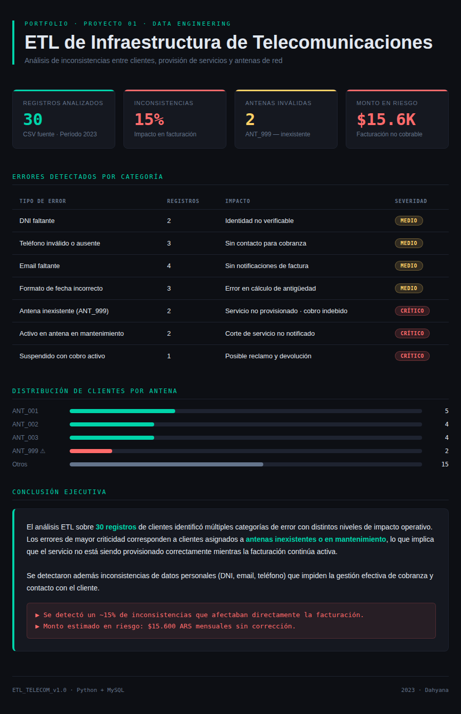

# Monitoreo de Infraestructura: Detección de brechas en facturación 📡

### El Problema (Contexto)
En el sector de telecomunicaciones, es común que la base de datos comercial no coincida con la técnica. Esto genera que clientes tengan servicios activos en antenas que no existen o que están en mantenimiento, resultando en cobros indebidos o falta de señal sin previo aviso.

### ¿Cómo lo resolví?
Diseñé un proceso ETL para cruzar los registros de **30 clientes** contra la base de infraestructura, detectando que un **15% de los datos presentaba inconsistencias críticas**.

### Stack Técnico
* **Python (Pandas):** Limpieza de strings, normalización de fechas y manejo de valores nulos en el archivo `clientes_sucio.csv`.
* **SQL:** Ejecución de JOINs para identificar usuarios colgados a la antena `ANT_999` (inexistente).
* **Visualización:** Reporte en HTML/CSS y Dashboards en **Grafana** y Power BI para mostrar el impacto financiero en tiempo real (estimado en **$15.6K**).

### Estructura del Repo
* `etl_limpieza.py`: El script donde sucede la magia de la limpieza.
* `consultas_etl.sql`: Las queries que usé para segmentar los errores por severidad.
* `reporte_final.html`: El entregable visual para el equipo de operaciones.

---
*Este proyecto fue parte de mi experiencia técnica en el sector de datos y telecomunicaciones.*
